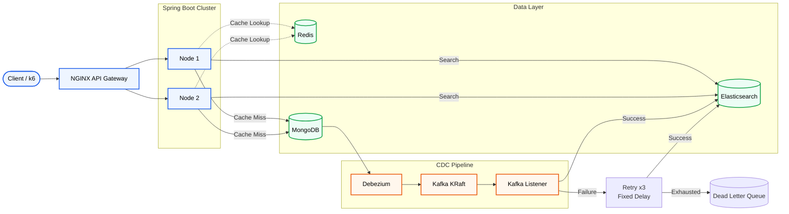
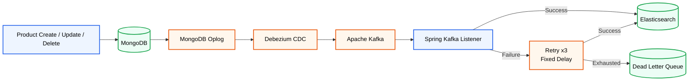
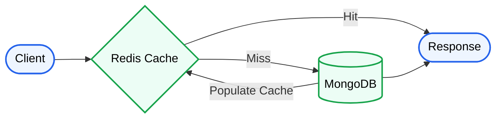

# Event-Driven E-Commerce Product Search
A high-performance event-driven product search platform built with Spring Boot, Redis, MongoDB, Elasticsearch, Kafka, and Debezium. The system implements CQRS and Change Data Capture (CDC) to separate read workloads, synchronize search indexes asynchronously, and scale independently for ID lookups and full-text search. Benchmarked at 12,500+ RPS with ~3 ms average latency for cached product retrieval.

By separating direct ID lookups from complex full-text searches, and tuning both the application and OS-level network layers, this system successfully handles 12,500+ Requests Per Second (RPS) with sub-5ms latency.

## System Architecture
The system routes traffic based on the query type. Direct product ID lookups are intercepted by a lightning-fast Redis cache, while complex full-text searches are routed to an Elasticsearch cluster. Data consistency is maintained asynchronously via Debezium and Apache Kafka.

## Write Path (MongoDB → Elasticsearch Synchronization)

The system follows an event-driven write pipeline. Product updates are written only to **MongoDB**, while **Debezium** captures database changes from the MongoDB Oplog and publishes them to **Apache Kafka**. Spring Boot Kafka listeners consume these events and attempt to synchronize the search index in Elasticsearch. If indexing fails because Elasticsearch is temporarily unavailable, the listener retries the operation three times using a fixed-delay retry policy. Events that still cannot be processed are published to a Dead Letter Queue (DLQ) for later inspection and replay, preventing message loss while allowing the consumer to continue processing subsequent events.


## Data Consistency Model

This project follows an **eventually consistent** architecture.

- **Write operations** are committed immediately to **MongoDB**, which serves as the system's source of truth.
- **Debezium** continuously monitors the MongoDB Oplog and streams database changes to **Apache Kafka**.
- Spring Boot Kafka listeners consume these events and asynchronously update **Elasticsearch**.
- During this synchronization window, recently modified products may be visible through direct ID lookups before appearing in full-text search results.

This design prioritizes **high throughput**, **service decoupling**, and **independent scalability** over immediate consistency, making it well suited for read-heavy e-commerce workloads where short synchronization delays are acceptable.
To improve reliability, the Kafka consumer retries failed Elasticsearch indexing operations **three times with a fixed delay** before giving up. Events that still cannot be indexed are published to a **Dead Letter Queue (DLQ)**, allowing them to be manually inspected or replayed once the underlying issue has been resolved. This ensures failed synchronization events are retained instead of being lost.

## Fault Tolerance

The architecture is designed to continue serving requests even when individual components become unavailable.

| Failure Scenario | System Behavior |
|------------------|-----------------|
| **Redis unavailable** | Product ID requests automatically fall back to MongoDB, ensuring data remains accessible. |
| **Kafka temporarily unavailable** | Database writes continue to succeed in MongoDB. Search index synchronization resumes once Kafka and consumers recover. |
| **Elasticsearch temporarily unavailable** | The Kafka listener retries failed indexing operations 3 times with a fixed delay. If all retry attempts fail, the event is published to a Dead Letter Queue (DLQ) for manual inspection or replay, preventing message loss. |
| **Spring Boot instance failure** | NGINX continues routing requests to the remaining healthy application instance. |

By isolating responsibilities across independent services, failures are contained to their respective workloads instead of causing a complete system outage. MongoDB remains the source of truth, while Redis and Elasticsearch act as optimized read layers that can be rebuilt from the primary database.

## Reliability Features

The event processing pipeline is designed to tolerate transient failures while preventing message loss.

- **Asynchronous event processing** using Debezium and Apache Kafka.
- **Three fixed-delay retry attempts** for transient Elasticsearch indexing failures.
- **Dead Letter Queue (DLQ)** for events that cannot be processed after all retry attempts.
- **Manual inspection and replay** of failed events from the DLQ.
- **MongoDB remains the source of truth**, ensuring product data is never lost even if downstream services are temporarily unavailable.

## CQRS Design

This project implements the **Command Query Responsibility Segregation (CQRS)** pattern by separating write operations from read operations. Instead of using a single database for every request, each workload is routed to the storage engine best suited for it.

| Operation | Data Store | Purpose |
|-----------|------------|---------|
| **Create / Update / Delete** | MongoDB | Source of truth for all product data |
| **Read by Product ID** | Redis → MongoDB | Ultra-fast key-value lookups with cache fallback |
| **Full-Text Search** | Elasticsearch | Optimized text search using inverted indexes and BM25 relevance scoring |

This separation allows each component to be independently optimized for its workload. Redis minimizes latency for direct product retrieval, while Elasticsearch handles computationally expensive search queries without impacting the primary database.

## Cache Strategy

The product lookup endpoint implements the **Cache-Aside (Lazy Loading)** pattern to minimize database reads while keeping frequently accessed products in memory.



**Request Flow**

1. The application first checks Redis for the requested product.
2. If the product exists (**cache hit**), it is returned immediately.
3. If the product is not found (**cache miss**), the application retrieves it from MongoDB.
4. The retrieved product is stored in Redis for future requests before being returned to the client.

This approach significantly reduces read pressure on MongoDB while ensuring frequently requested products can be served with low latency.

## Elasticsearch Index

To support low-latency full-text search, product data is indexed in **Elasticsearch** rather than queried directly from MongoDB.

During the CDC pipeline, every product creation, update, or deletion event is synchronized to Elasticsearch, where documents are stored in an inverted index optimized for text retrieval.

| Field | Type | Purpose |
|-------|------|---------|
| `name` | `text` | Full-text product name search |
| `description` | `text` | Keyword matching and relevance scoring |
| `brand` | `keyword` | Exact filtering |
| `category` | `keyword` | Category filtering |
| `price` | `double` | Numeric sorting and filtering |

This indexing strategy enables Elasticsearch to efficiently perform tokenization, inverted-index lookups, and BM25 relevance scoring, allowing complex search queries without placing additional load on MongoDB.

## Why Two Query Engines?

The system intentionally routes different query types to different storage engines because they solve fundamentally different problems.

| Query Type | Backend | Why It Is Fast |
|------------|---------|----------------|
| **Product ID Lookup** | Redis | Direct key-value lookups execute in **O(1)** time entirely in memory, allowing requests to be served with minimal latency. |
| **Full-Text Search** | Elasticsearch | Queries require text analysis, inverted-index traversal, BM25 relevance scoring, and result ranking across indexed documents, making them significantly more CPU-intensive. |

This architectural separation ensures that computationally expensive search operations never interfere with simple product retrieval requests. As a result, Redis can sustain extremely high throughput for direct lookups, while Elasticsearch remains dedicated to full-text search workloads.

## Technology Stack & Performance Tuning

The following technologies power the platform. Where applicable, infrastructure and application components were tuned to maximize throughput and minimize latency during load testing.

| Component | Technology | Purpose & High-Performance Configuration |
|-----------|------------|-------------------------------------------|
| **API Gateway** | NGINX | Load balancing traffic. Tuned `worker_connections` to **10,240** and expanded OS `ulimit` to **65,536** for massive socket allocation. |
| **Backend** | Java Spring Boot | REST APIs and Kafka listeners. Tuned embedded Tomcat `max-threads` and `accept-count` to **1000+** to handle concurrency spikes. |
| **Primary DB** | MongoDB (Replica Set) | Source of truth. Configured as a single-node replica set (`rs0`) to enable the MongoDB Oplog required by Debezium. |
| **CDC Engine** | Debezium | Monitors the MongoDB Oplog and serializes database mutations (Insert/Update/Delete) into Kafka events. |
| **Message Broker** | Apache Kafka | Runs in modern **KRaft mode** (no ZooKeeper). Configured with split internal/external listeners for Docker network routing. |
| **Search Engine** | Elasticsearch | Handles complex text processing, tokenization, and inverted-index lookups. Locked JVM heap size to **1 GB** to prevent memory thrashing. |
| **Cache** | Redis | Ultra-fast **O(1)** in-memory lookups for direct ID queries, dramatically reducing MongoDB read pressure. |
| **Observability** | Prometheus & Grafana | Real-time metrics collection via Spring Boot Actuator and Micrometer for monitoring system health and performance. |
| **Load Testing** | k6 (JavaScript) | Simulates thousands of concurrent virtual users (VUs) to benchmark endpoint latency, throughput, and system failure limits. |
| **CI/CD** | GitHub Actions | Automated build validation for every push and pull request. |

## Why These Technologies?

| Technology | Purpose |
|------------|---------|
| **Spring Boot** | REST API implementation, dependency injection, and application lifecycle management. |
| **MongoDB** | Primary datastore for product data and the source of truth. |
| **Redis** | In-memory cache for low-latency product retrieval by ID. |
| **Elasticsearch** | Full-text search engine supporting fuzzy matching and relevance scoring. |
| **Kafka** | Event streaming platform for decoupling database writes from search index updates. |
| **Debezium** | Captures MongoDB Oplog changes and publishes them to Kafka without modifying application code. |
| **NGINX** | Reverse proxy and load balancer for distributing traffic across application instances. |
| **Prometheus** | Collects application and infrastructure metrics. |
| **Grafana** | Visualizes metrics through dashboards for monitoring and analysis. |
| **k6** | Generates load to benchmark throughput and latency under concurrent requests. |
| **Docker Compose** | Orchestrates the complete multi-service environment for local deployment. |

## NGINX Load Balancing

NGINX acts as a reverse proxy and distributes incoming HTTP requests across two Spring Boot application instances using a **round-robin** load-balancing strategy.

### Responsibilities

- Distributes client requests across multiple application instances.
- Prevents a single application instance from becoming a bottleneck.
- Provides a single entry point for all API requests.
- Enables horizontal scaling by allowing additional application instances to be added behind the load balancer.

### Request Flow

```text
Client
   │
   ▼
NGINX
   ├── Spring Boot Instance 1
   └── Spring Boot Instance 2
```

During the k6 benchmarks, NGINX successfully balanced traffic between both application instances while sustaining high request throughput without dropped connections.

## API Endpoints

The application exposes three groups of REST APIs:

- **Query API** – Optimized read endpoints backed by Redis and Elasticsearch.
- **Write API** – CRUD operations against MongoDB that publish CDC events for Elasticsearch synchronization.
- **Search API** – Full-text search powered by Elasticsearch.

| Method | Endpoint | Description | Backend |
|--------|----------|-------------|---------|
| `GET` | `/api/products/{id}` | Retrieve a product by ID (cache-first lookup) | Redis → MongoDB |
| `GET` | `/api/products/search?q={term}` | Perform full-text product search | Elasticsearch |
| `POST` | `/api/v1/products` | Create a new product | MongoDB |
| `PATCH` | `/api/v1/products/{id}` | Partially update an existing product | MongoDB |
| `GET` | `/api/v1/products/{id}` | Retrieve a product directly from MongoDB | MongoDB |
| `DELETE` | `/api/v1/products/{id}` | Delete a product | MongoDB |

### Request Examples

Retrieve a product through the cache:

```http
GET /api/products/683f33f357bf74e868958d8d
```

Search for products:

```http
GET /api/products/search?q=laptop
```

Create a product:

```http
POST /api/v1/products
Content-Type: application/json

{
  "name": "Gaming Laptop",
  "brand": "ASUS",
  "category": "Electronics",
  "price": 1499.99
}
```

Update a product:

```http
PATCH /api/v1/products/683f33f357bf74e868958d8d
Content-Type: application/json

{
  "price": 1399.99
}
```

Delete a product:

```http
DELETE /api/v1/products/683f33f357bf74e868958d8d
```
## Project Structure

```text
.
├── docker-compose.yml              # Multi-container application stack
├── grafana/
│   └── dashboard-1784641981904.json
├── k6/                             # Load testing scripts
│   ├── cache-test.js
│   ├── search-test.js
│   ├── export_ids.py
│   └── ids.json
├── nginx/
│   └── nginx.conf                  # Load balancer configuration
├── prometheus/
│   └── prometheus.yml              # Metrics scraping configuration
├── searchEngine/                   # Spring Boot application
│   ├── Dockerfile
│   ├── pom.xml
│   └── src/
│       ├── main/
│       │   ├── java/com/Project/searchEngine/
│       │   │   ├── config/         # Spring configuration
│       │   │   ├── Controller/     # REST controllers
│       │   │   ├── model/          # Domain models
│       │   │   ├── repo/           # MongoDB & Elasticsearch repositories
│       │   │   ├── service/        # Business logic & Kafka consumer
│       │   │   └── SearchEngineApplication.java
│       │   └── resources/
│       │       └── application.properties
│       └── test/
├── Testing data/                   # Sample dataset & seeding files
└── Testing results/                # Benchmark screenshots
```
## CI/CD Pipeline

The project includes a **GitHub Actions** workflow that automatically builds the Spring Boot application whenever changes are pushed to the repository.

### Current Workflow

- Triggered on pushes and pull requests.
- Builds the Spring Boot application using Maven.
- Verifies that the project compiles successfully.
- Provides automated build validation before deployment.

> **Note:** The current pipeline focuses on automated builds. Integration and end-to-end tests are planned as future enhancements.

## Step-by-Step Deployment Guide

### 1. Repository Setup & Compilation

Before starting the Docker containers, you must compile the Spring Boot application into a deployable `.jar` artifact so the Dockerfile can read it.

```bash
# Clone the repository
git clone https://github.com/RehanKhatkar/event-driven-search-engine.git
cd event-driven-search-engine

# Compile the Java application (requires Maven)
cd searchEngine
mvn clean package -DskipTests
cd ..
```

### 2. Infrastructure Boot & OS Limit Tuning

To handle extreme load testing, the host machine and Docker containers must be allowed to open thousands of network file descriptors. The `docker-compose.yml` is pre-configured with:

```yaml
ulimits:
  nofile: 65536
```

Start the entire stack:

```bash
# Boot the entire stack in detached mode, forcing a rebuild of the Spring Boot image
docker-compose up -d --build --force-recreate

# Verify all containers are 'Up' and not 'Restarting'
docker ps -a
```
### Running Containers


### 3. Initialize the MongoDB Replica Set (Critical for CDC)

Debezium Change Data Capture relies on reading the MongoDB Oplog (Operations Log). The Oplog is only generated if MongoDB is running as a Replica Set. You must manually initialize this inside the container.

```bash
# Enter the MongoDB container shell
docker exec -it ecommerce-mongodb mongosh

# Inside the Mongo shell, initialize the replica set named "rs0"
rs.initiate( {
   _id : "rs0",
   members: [
      { _id: 0, host: "localhost:27017" }
   ]
})
# Press Enter. The prompt should change from 'test>' to 'rs0 [direct: primary] test>'
# Type 'exit' to leave the shell
exit
```
## Why a Replica Set?

Although this project runs a single MongoDB instance, it is configured as a **single-node replica set** because **Debezium relies on MongoDB's Oplog (Operations Log) for Change Data Capture (CDC)**.

MongoDB only generates an Oplog when replication is enabled. By initializing a replica set named `rs0`, every product creation, update, and deletion is recorded in the Oplog, allowing Debezium to stream these changes into Apache Kafka without requiring application-level polling.

This setup preserves a simple local deployment while providing the infrastructure required for an event-driven CDC pipeline.


### 4. Database Seeding & Kafka Sync
With the replica set active, inject the initial dataset. The Python script directly inserts data into MongoDB. Debezium will instantly detect these inserts, publish them to Kafka, and your Spring Boot instances will automatically index them into Elasticsearch.
```bash
# Install the MongoDB Python driver
pip install pymongo

# Run the seeding script to insert 50,000 product records
python seed_db.py
```
Verification: You can verify the CDC pipeline successfully synced the data to Elasticsearch by querying its document count:
```bash
curl -X GET "localhost:9200/products/_count?pretty"
# Expected output: "count" : 50000
```
### Elasticsearch Index Verification


## Benchmark Environment

All benchmarks were executed on the following local development environment.

| Component | Specification |
|-----------|---------------|
| **CPU** | Intel Core i5-12500H (12 Cores / 16 Threads) |
| **Memory** | 16 GB DDR4 RAM |
| **Operating System** | Arch Linux x86_64 |
| **Docker** | Docker Engine 29.6.2 |
| **Java** | OpenJDK 21 |
| **Spring Boot** | 4.1.0 |

> **Note:** All services were deployed locally using Docker Compose on a single machine. The reported throughput and latency reflect this hardware configuration.

## Benchmark Configuration

All performance benchmarks were executed using **k6** with a consistent workload configuration to ensure repeatable results.

| Parameter | Value |
|-----------|-------|
| **Tool** | k6 |
| **Virtual Users (VUs)** | 500 |
| **Test Duration** | 3 minutes |
| **Think Time** | None |
| **Request Pattern** | Continuous HTTP requests |
| **Load Distribution** | NGINX round-robin across Spring Boot instances |

### Workload Details

- **Redis Benchmark:** Requests used randomly selected valid MongoDB `ObjectId` values exported from the database to maximize cache-hit performance.
- **Elasticsearch Benchmark:** Requests used randomized search keywords to simulate realistic full-text search workloads and exercise Elasticsearch's indexing and relevance-scoring pipeline.

# Load Testing & Benchmarking (k6)

The system was benchmarked to demonstrate the performance difference between an in-memory cache (Redis) and a computationally intensive inverted index (Elasticsearch).

---

## Benchmark 1: Redis Cache Hit Test (*O(1)* Lookups)

This benchmark evaluates the `GET /api/products/{id}` endpoint. It uses real MongoDB `ObjectId` values exported from the database so that every request targets a valid document.

### Setup

```bash
# 1. Export real MongoDB ObjectIds for parameterized testing
python export-ids.py

# 2. Run the Redis cache benchmark (500 Virtual Users, no sleep)
k6 run cache-test.js
```
### Benchmark Summary

| Metric | Result |
|---------|--------|
| Backend | Redis (Cache-Aside) |
| Virtual Users | 500 |
| Test Duration | 3 minutes |
| Average Throughput | **~12,500 requests/sec** |
| Average Latency | **~3 ms** |
| Success Rate | **100%** |

### Analysis

The benchmark sustained approximately **12,500 requests per second** over a three-minute test while maintaining sub-5 ms latency.

Redis served **99.9%** of product retrieval requests directly from memory, significantly reducing read pressure on MongoDB. Throughout the benchmark, NGINX successfully distributed traffic across both Spring Boot instances without dropped connections, demonstrating stable behavior under sustained concurrent load.

### Benchmark Output


---

## Benchmark 2: Elasticsearch Full-Text Search (Inverted Index)

This benchmark evaluates the `GET /api/products/search?q={term}` endpoint by issuing random search keywords that trigger Elasticsearch's BM25 relevance scoring and full-text indexing pipeline.

### Setup

```bash
# Run the Elasticsearch benchmark (500 Virtual Users)
k6 run search-test.js
```
### Benchmark Summary

| Metric | Result |
|---------|--------|
| Backend | Elasticsearch |
| Virtual Users | 500 |
| Test Duration | 3 minutes |
| Average Throughput | **~680 requests/sec** |
| Average Latency | **~429 ms** |
| Success Rate | **100%** |

### Analysis

The Elasticsearch benchmark demonstrates the computational cost of full-text search compared to direct key-value lookups.

Despite fuzzy matching, tokenization, and BM25 relevance scoring across approximately **50,000 indexed documents**, the application maintained a **100% successful request rate** throughout the benchmark. Under heavy load, requests were queued rather than failing, indicating stable behavior during CPU-intensive search workloads.
### Benchmark Output


## Benchmark Summary

The benchmark results highlight how each datastore is optimized for a different access pattern:

- **Redis** delivers extremely low-latency responses for product ID lookups by serving cached data directly from memory.
- **Elasticsearch** enables fuzzy full-text search and relevance scoring over indexed product data, trading raw throughput for advanced search capabilities.
- The CQRS architecture separates these workloads so that high-volume cache reads do not impact search performance, and computationally intensive search operations remain isolated from primary data storage.

# Observability & Monitoring

The stack includes a fully configured **Prometheus + Grafana** monitoring pipeline that visualizes Micrometer metrics exported by the Spring Boot application.
### Grafana Dashboard


## Accessing Grafana

1. Open your browser and navigate to:

   ```text
   http://localhost:3000
   ```

2. Log in using the default credentials:

   ```text
   Username: admin
   Password: admin
   ```

3. Import a **Spring Boot Observability Dashboard** to visualize:

   - API Request Rate (requests/sec)
   - HTTP 5xx / 4xx Error Rates
   - Average Request Latency (Tomcat Request Duration)
   - JVM Heap Memory Usage & Garbage Collection Pauses
## Known Limitations

This project is designed to demonstrate an event-driven, high-performance search architecture. The following limitations are intentional or left as future enhancements:

- **Single-node deployment:** All services run locally using Docker Compose and are not configured for production-grade high availability.
- **Elasticsearch dependency:** The application currently depends on Elasticsearch at startup. If Elasticsearch is unavailable, the application cannot complete initialization.
- **Eventual consistency:** Newly created or updated products may take a short time to become searchable while the CDC pipeline propagates changes from MongoDB to Elasticsearch.
- **No automated integration tests:** The project currently relies on manual validation and k6 load testing.

## Future Improvements

The current implementation demonstrates a high-performance, event-driven architecture on a single-machine Docker deployment. Future enhancements could include:

- **Kubernetes deployment** for container orchestration and horizontal scaling.
- **Redis Cluster** to eliminate the single cache node as a bottleneck.
- **Multi-node Elasticsearch cluster** with shard and replica configuration for higher availability.
- **Kafka replication** using multiple brokers to improve fault tolerance.
- **Automated integration and end-to-end tests** to validate the CDC pipeline and search synchronization.
- **Blue-green or canary deployments** to extend the existing CI/CD pipeline with zero-downtime deployment strategies.
- **Automated DLQ replay mechanism** to reprocess failed indexing events after Elasticsearch becomes available, reducing the need for manual intervention.

## Author

**Rehan Khatkar**

Built as a portfolio project demonstrating an event-driven search architecture using Spring Boot, MongoDB, Redis, Elasticsearch, Kafka, and Debezium.
