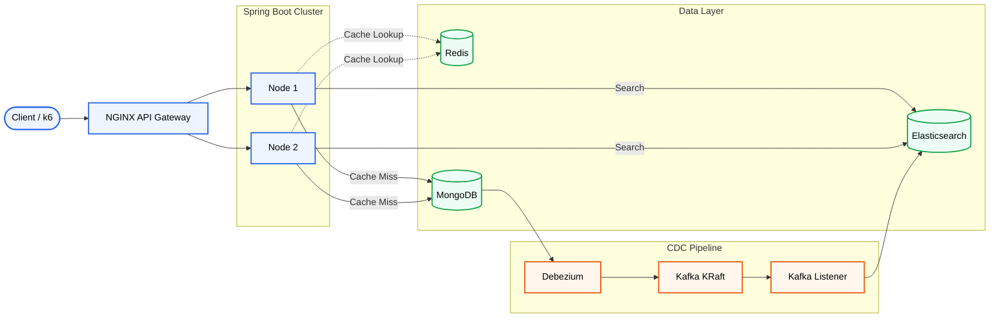

# Event-Driven E-Commerce Product Search
A high-performance, fault-tolerant microservices architecture designed to handle massive read-heavy e-commerce traffic. This project implements the Command Query Responsibility Segregation (CQRS) pattern and Change Data Capture (CDC) to intelligently route and serve product data at scale.

By separating direct ID lookups from complex full-text searches, and tuning both the application and OS-level network layers, this system successfully handles 12,500+ Requests Per Second (RPS) with sub-5ms latency.

## System Architecture
The system routes traffic based on the query type. Direct product ID lookups are intercepted by a lightning-fast Redis cache, while complex full-text searches are routed to an Elasticsearch cluster. Data consistency is maintained asynchronously via Debezium and Apache Kafka.

## Tech Stack & Tuning

| Component | Technology | Purpose & High-Performance Configuration |
|-----------|------------|-------------------------------------------|
| **API Gateway** | NGINX | Load balancing traffic. Tuned `worker_connections` to **10,240** and expanded OS `ulimit` to **65,536** for massive socket allocation. |
| **Backend** | Java Spring Boot | REST APIs and Kafka listeners. Tuned embedded Tomcat `max-threads` and `accept-count` to **1000+** to handle concurrency spikes. |
| **Primary DB** | MongoDB (Replica Set) | Source of truth. Configured as a single-node replica set (`rs0`) to enable the MongoDB Oplog required by Debezium. |
| **CDC Engine** | Debezium | Monitors the MongoDB Oplog and serializes database mutations (Insert/Update/Delete) into Kafka events. |
| **Message Broker** | Apache Kafka | Runs in modern **KRaft mode** (no ZooKeeper). Configured with split internal/external listeners for Docker network routing. |
| **Search Engine** | Elasticsearch | Handles complex text processing, tokenization, and inverted-index lookups. Locked JVM heap size to **1 GB** to prevent memory thrashing. |
| **Cache** | Redis | Ultra-fast **O(1)** in-memory lookups for direct ID queries, dramatically reducing MongoDB read pressure. |
| **Observability** | Prometheus & Grafana | Real-time metrics collection via Spring Boot Actuator and Micrometer for monitoring system health and performance. |
| **Load Testing** | k6 (JavaScript) | Simulates thousands of concurrent virtual users (VUs) to benchmark endpoint latency, throughput, and system failure limits. |

## Step-by-Step Deployment Guide

### 1. Repository Setup & Compilation

Before starting the Docker containers, you must compile the Spring Boot application into a deployable `.jar` artifact so the Dockerfile can read it.

```bash
# Clone the repository
git clone https://github.com/RehanKhatkar/event-driven-search-engine.git
cd event-driven-search-engine

# Compile the Java application (requires Maven)
cd searchEngine
mvn clean package -DskipTests
cd ..
```

### 2. Infrastructure Boot & OS Limit Tuning

To handle extreme load testing, the host machine and Docker containers must be allowed to open thousands of network file descriptors. The `docker-compose.yml` is pre-configured with:

```yaml
ulimits:
  nofile: 65536
```

Start the entire stack:

```bash
# Boot the entire stack in detached mode, forcing a rebuild of the Spring Boot image
docker-compose up -d --build --force-recreate

# Verify all containers are 'Up' and not 'Restarting'
docker ps -a
```

### 3. Initialize the MongoDB Replica Set (Critical for CDC)

Debezium Change Data Capture relies on reading the MongoDB Oplog (Operations Log). The Oplog is only generated if MongoDB is running as a Replica Set. You must manually initialize this inside the container.

```bash
# Enter the MongoDB container shell
docker exec -it ecommerce-mongodb mongosh

# Inside the Mongo shell, initialize the replica set named "rs0"
rs.initiate( {
   _id : "rs0",
   members: [
      { _id: 0, host: "localhost:27017" }
   ]
})
# Press Enter. The prompt should change from 'test>' to 'rs0 [direct: primary] test>'
# Type 'exit' to leave the shell
exit
```

### 4. Database Seeding & Kafka Sync
With the replica set active, inject the initial dataset. The Python script directly inserts data into MongoDB. Debezium will instantly detect these inserts, publish them to Kafka, and your Spring Boot instances will automatically index them into Elasticsearch.
```bash
# Install the MongoDB Python driver
pip install pymongo

# Run the seeding script to insert 50,000 product records
python seed_db.py
```
Verification: You can verify the CDC pipeline successfully synced the data to Elasticsearch by querying its document count:
```bash
curl -X GET "localhost:9200/ecommerce_search.products/_count?pretty"
# Expected output: "count" : 50000
```
# Load Testing & Benchmarking (k6)

The system was benchmarked to demonstrate the performance difference between an in-memory cache (Redis) and a computationally intensive inverted index (Elasticsearch).

---

## Benchmark 1: Redis Cache Hit Test (*O(1)* Lookups)

This benchmark evaluates the `GET /api/products/{id}` endpoint. It uses real MongoDB `ObjectId` values exported from the database so that every request targets a valid document.

### Setup

```bash
# 1. Export real MongoDB ObjectIds for parameterized testing
python export-ids.py

# 2. Run the Redis cache benchmark (500 Virtual Users, no sleep)
k6 run cache-test.js
```

### Results

- **Throughput:** Sustained **~12,500 Requests Per Second (RPS)**.
- **Average Latency:** **3.06 ms**
- **Total Volume:** Processed **3.5+ million requests** in a 3-minute benchmark.
- **Architecture Validation:** Redis served **99.9%** of read requests directly from memory, effectively shielding MongoDB from read pressure. NGINX successfully balanced traffic across both Spring Boot instances without dropped connections.

---

## Benchmark 2: Elasticsearch Full-Text Search (Inverted Index)

This benchmark evaluates the `GET /api/products/search?q={term}` endpoint by issuing random search keywords that trigger Elasticsearch's BM25 relevance scoring and full-text indexing pipeline.

### Setup

```bash
# Run the Elasticsearch benchmark (500 Virtual Users)
k6 run search-test.js
```

### Results

- **Throughput:** Sustained **680 Requests Per Second (RPS)**.
- **Average Latency:** **~429 ms**
- **Total Volume:** Processed **122,000+ requests**, transferring approximately **21 GB** of JSON payload during the 3-minute benchmark.
- **Architecture Validation:** Despite the heavy CPU workload of tokenizing text and scoring approximately **50,000 documents per query**, the Spring Boot application maintained a **0.00% 5xx error rate**. Requests were queued gracefully under load instead of failing, demonstrating stable behavior during computationally expensive searches.
# Observability & Monitoring

The stack includes a fully configured **Prometheus + Grafana** monitoring pipeline that visualizes Micrometer metrics exported by the Spring Boot application.

## Accessing Grafana

1. Open your browser and navigate to:

   ```text
   http://localhost:3000
   ```

2. Log in using the default credentials:

   ```text
   Username: admin
   Password: admin
   ```

3. Import a **Spring Boot Observability Dashboard** to visualize:

   - API Request Rate (requests/sec)
   - HTTP 5xx / 4xx Error Rates
   - Average Request Latency (Tomcat Request Duration)
   - JVM Heap Memory Usage & Garbage Collection Pauses
